# The short version

I pulled four years of US Google search volume for 1,052 AI job titles — every title I could
assemble from four independently generated lists — to find out which ones people actually look
up.

Three things came out of it, and the first one is not what I went looking for.

**Most "AI job titles" are not jobs.** 71% of all the search volume belongs to terms like
`ai photo editor` and `ai lawyer`, where the person searching wants software that does the work,
not a career doing it. That single distinction reorganises the entire dataset.

**The hottest AI job title already peaked.** `prompt engineer` topped out in June 2023 and is
down roughly 70%. The title that quietly overtook it — `ai engineer` — never spiked at all.

**Two-thirds of the titles have no demand whatsoever.** Of 1,052 titles in circulation, only 390
register any search volume at all. The AI-jobs conversation is running well ahead of anyone
actually looking these roles up.

---

# Where the data comes from

Google Ads Keyword Planner API, United States, August 2022 through July 2026. Retrieved
2026-07-29.

The title list was assembled by pooling four independently generated sets — two hand-built, one
from Gemini, one from Claude — then deduplicating and filtering to genuinely AI-specific roles.
Machine learning and data science titles were excluded unless they named AI explicitly, since
the question is about AI demand rather than analytics demand generally. LLM, RAG, agentic and
prompt-style names were kept.

| Stage | Count |
|---|---|
| Titles in the master list | 1,052 |
| Unique after normalisation | 1,051 |
| Returned by the API | 1,048 |
| With any search volume | 390 |
| After collapsing identical series and zero-volume rows | 379 |
| Modelable (peak above 20 searches/month) | 283 |
| — career intent | 254 |
| — tool intent | 29 |

A 37% hit rate on a deliberately generous candidate list is the expected outcome, not a
shortfall. The interesting part is which titles fall away.

::: {.callout-note}
Keyword Planner reports **rounded buckets** (720, 880, 1,000, 1,300…), not exact counts, and
reported volume can be inflated by bot or AI-driven traffic. Every figure here is an order of
magnitude with a direction, not a precise measurement.
:::

---

# Finding 1: most of this demand is people shopping for software

The single largest term in the whole dataset is `ai photo editor`, at 201,000 searches a month.
It is not a job title in any meaningful sense. Neither is `ai videographer` (49,500), `ai writer`
(33,100) or `ai lawyer` (18,100) — somebody typing "ai lawyer" wants cheap legal help, not a
law degree.

29 such terms carry 359,240 searches a month between them. The 254 genuine career terms carry
146,610.

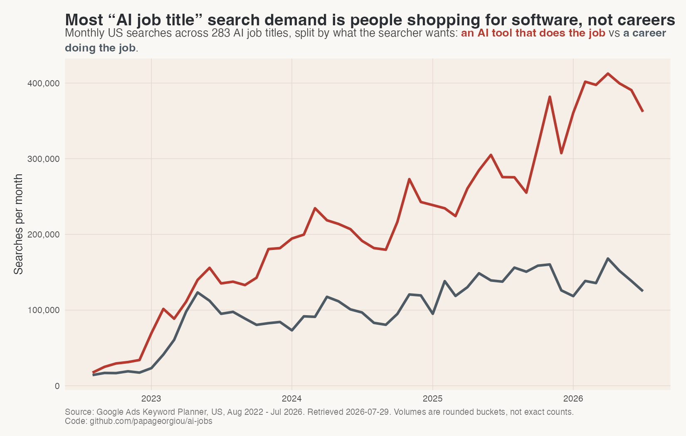

This is not a rounding issue that can be filtered away quietly. These terms are concentrated
enough to swallow entire categories: before separating them out, `ai photo editor` alone was 63%
of the design cluster and `ai lawyer` was 95% of governance and ethics. Any analysis that pools
them reports AI product demand while claiming to report job-title demand.

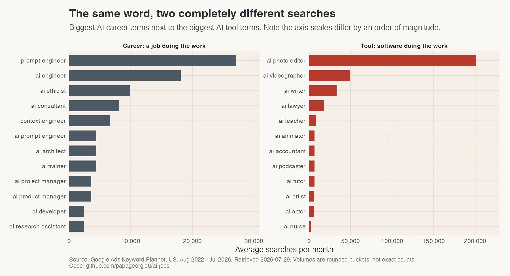

Note the axis scales differ by an order of magnitude. The biggest "career" term in the dataset is
smaller than the fourth-biggest "tool" term.

Everything from here on is career-intent terms only.

---

# Finding 2: prompt engineer already peaked

The most-searched AI career term is `prompt engineer`. It topped out three years ago.

- Peak: **65,000/month, June 2023**
- Latest: **19,467/month**
- Down roughly **70%** from peak

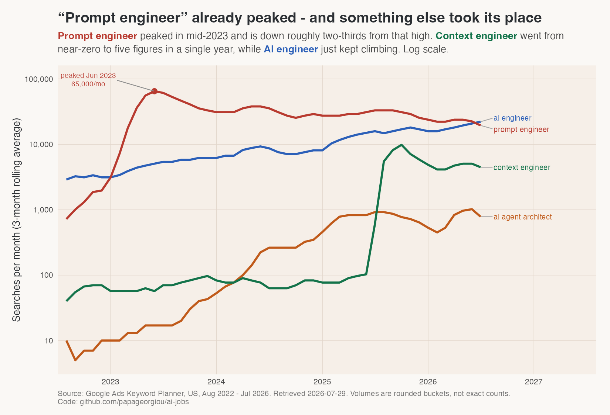

Two things make this more interesting than a simple decline.

**`ai engineer` never spiked and never fell.** It went from 4,017/month to 18,300/month and hit
its highest-ever month in July 2026 — the last month of data. It has now overtaken prompt
engineer. The durable title turned out to be the boring one.

**`context engineer` came from nothing.** 62 searches/month in the first year, 5,975 in the last
— a 96x increase, the fastest in the dataset.

That series is a step change rather than a ramp: flat until July 2025, then a jump of 164x the
median. The spike detector flags it. It is worth being explicit about why it is credible anyway
— "context engineering" entered circulation as a term in mid-2025, and sudden vocabulary
adoption is exactly this shape. It is not the slow drift of bot traffic. It has since settled
back to around 4,500/month, so the peak was an adoption spike rather than a new plateau.

The industry replaced its hottest job title in under two years.

---

# Finding 3: growth rate and net volume disagree

Almost every "fastest-growing jobs" list picks one metric and quietly hides the other. They rank
nearly disjoint sets of titles.

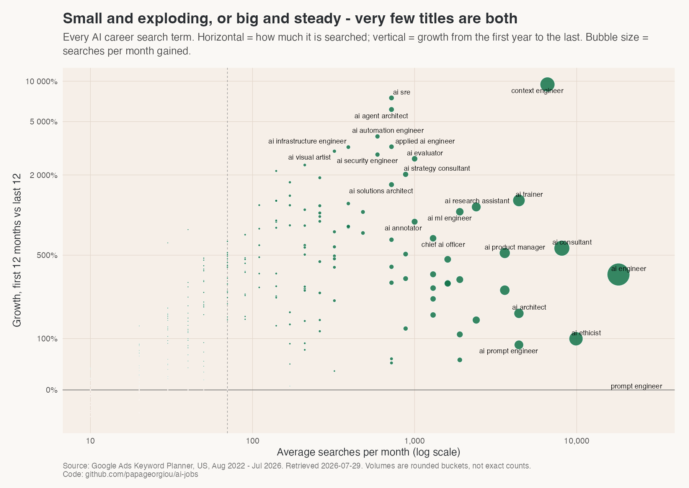

Ranked by **percentage growth**, the top is titles that barely existed in 2022 — `ai sre`
(+7,509%), `ai agent architect` (+6,157%), `ai automation engineer` (+3,876%). All real signals.
All under 1,000 searches a month. Percentage growth flatters a small base.

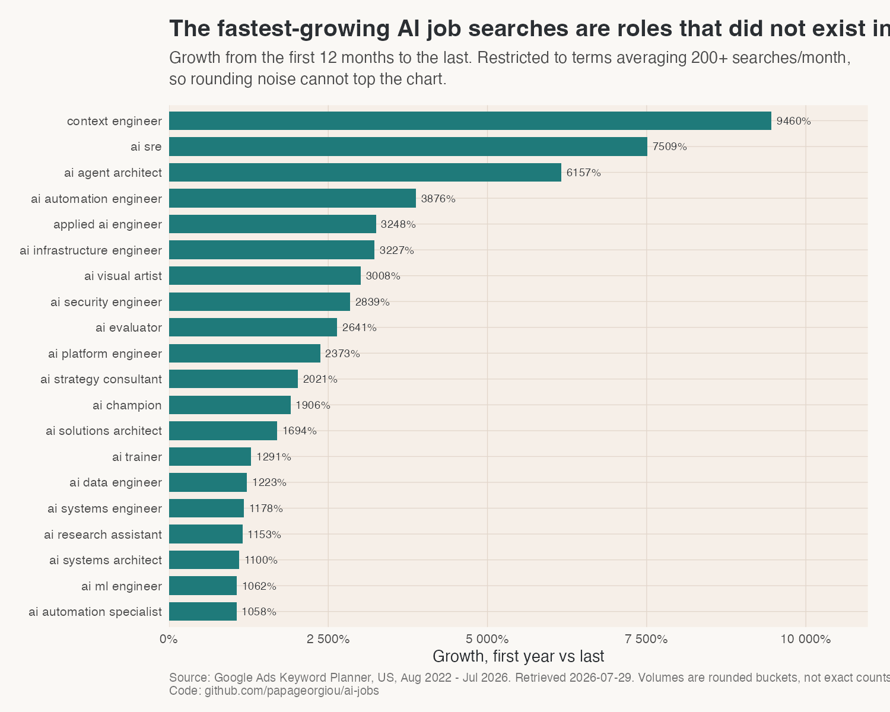

Ranked by **searches actually gained**, it is a different list:

| Title | Searches/mo gained | Growth |
|---|---|---|
| ai engineer | +14,283 | +357% |
| ai consultant | +6,663 | +566% |
| context engineer | +5,913 | +9,460% |
| ai ethicist | +5,233 | +100% |
| ai trainer | +3,991 | +1,291% |

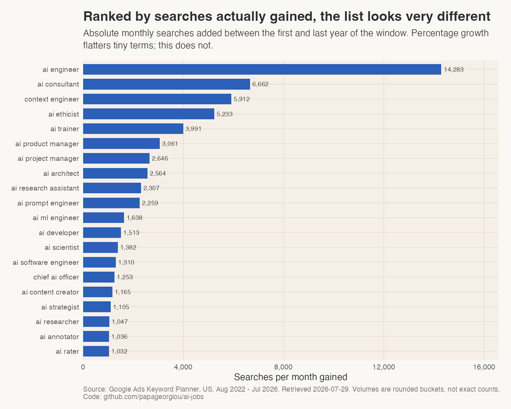

Only `context engineer` sits near the top of both lists. That is what makes it the standout
term of the four years rather than merely a fast one.

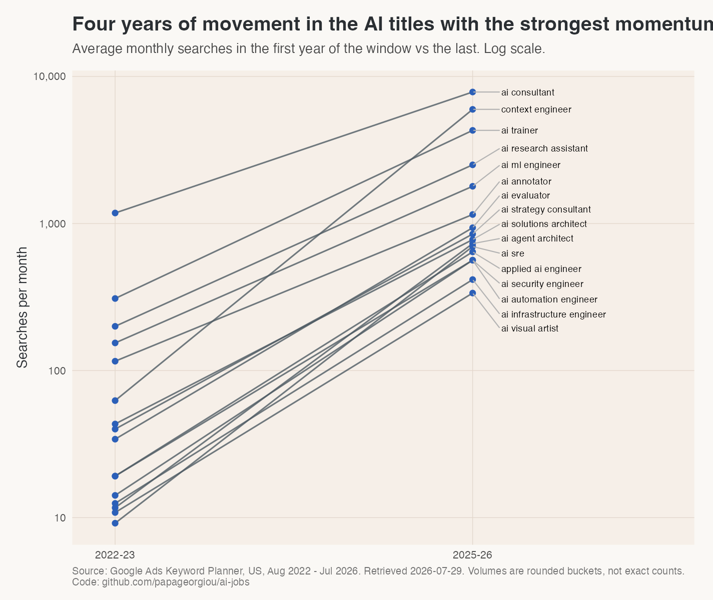

---

# Finding 4: the whole field, at a glance

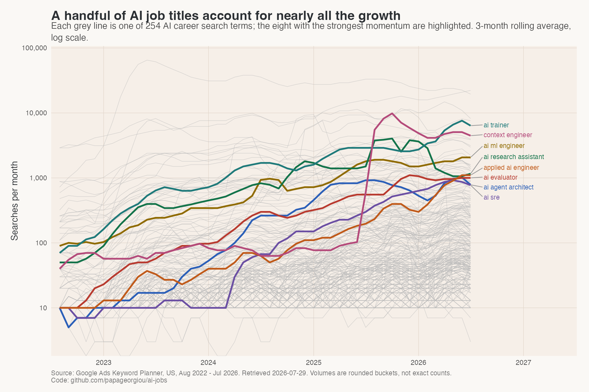

Log scale, because a linear axis renders every line of interest as flat next to prompt engineer.

The titles that rise steadily — rather than spiking and falling back — are a smaller group than
the growth rankings suggest:

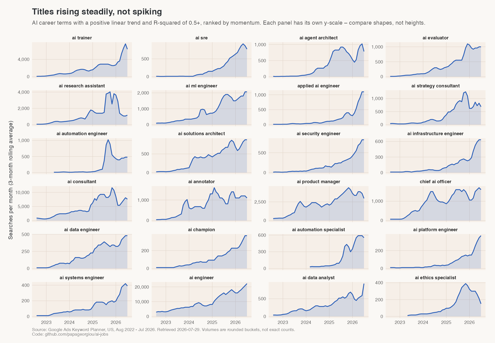

Each panel has its own vertical scale, so compare shapes rather than heights.

---

# Finding 5: clusters

Career-intent volume grouped by what the role actually does:

| Function | Terms | Searches/mo | Gained |
|---|---|---|---|
| engineering | 76 | 79,230 | +37,616 |
| product & program | 22 | 19,660 | +15,629 |
| research | 13 | 6,970 | +5,603 |
| data & alignment | 10 | 5,470 | +4,219 |
| education & coaching | 8 | 4,870 | +4,288 |
| design & creative | 22 | 4,490 | +2,946 |
| leadership | 12 | 2,880 | +2,232 |
| infrastructure & ops | 10 | 1,690 | +1,541 |
| governance & ethics | 15 | 910 | +405 |

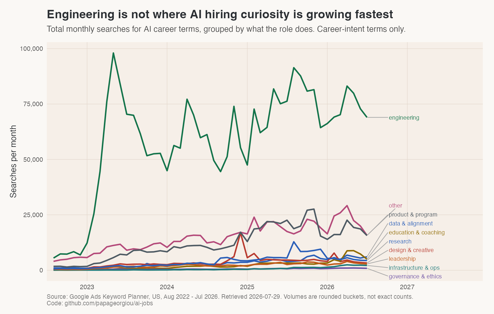

**Engineering dominates but is not the whole story** — 54% of career volume, yet product and
program management gained nearly half as many searches off a quarter of the base.

**Governance and ethics is remarkably small.** 15 distinct titles, 910 searches a month between
them, almost no growth. For the volume of conference attention AI governance receives, close to
nobody is searching these roles as careers.

## Nobody searches for a seniority level

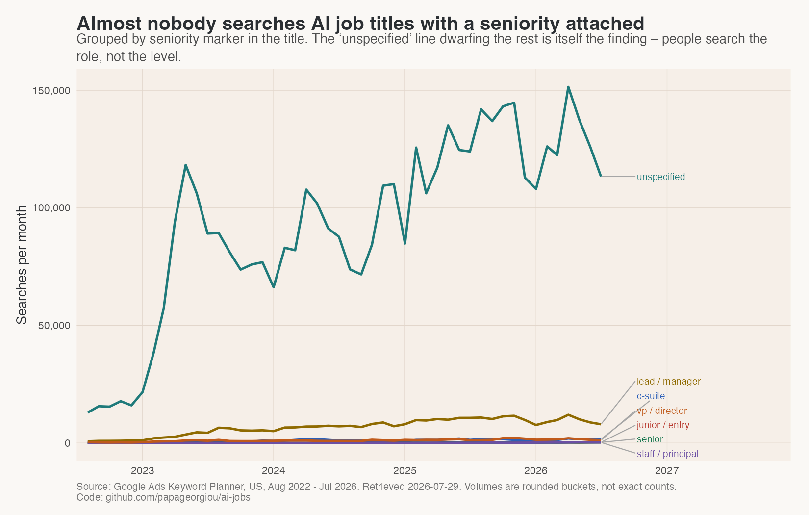

231 of 254 career terms carry no seniority marker, and they account for essentially all the
volume. `senior ai engineer`, `staff ai engineer` and `principal ai engineer` are rounding
errors.

People search the role, not the level. Any content or SEO strategy built around
seniority-qualified AI titles is targeting demand that does not exist.

## And almost nobody searches by industry

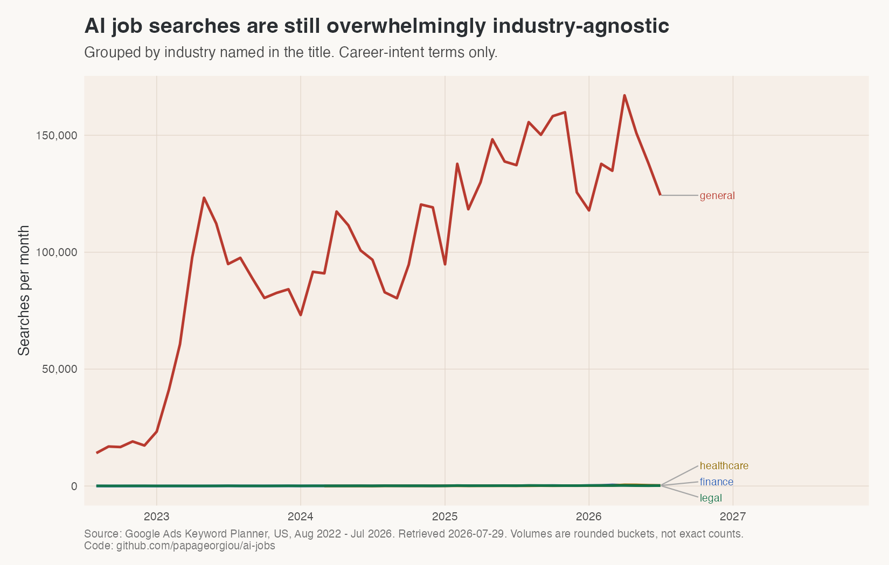

270 of 283 terms are industry-agnostic. `healthcare ai engineer` and the finance equivalents
barely register — despite both being heavily promoted as the next frontier.

---

# Caveats worth stating

- **Reported volume is not ground truth.** Rounded buckets, and inflatable by non-human traffic.
- **76 non-seasonal spikes were flagged**, 3 of them material. `context engineer` is discussed
  above and judged genuine; `ai actor` and `ai artist` are both tool-intent, so they sit outside
  the career analysis.
- **The tool-versus-career split is a judgement call**, applied by rule against a list of
  professions AI performs as a service. `ai trainer` and `ai architect` were deliberately kept
  as careers despite matching the pattern.
- **`ai ethicist` (9,900/month) falls into the `other` function bucket**, which understates
  governance and ethics in the table above. Even adding it back, the cluster is small and its
  growth is driven by that single term.

---

# Method

Full pipeline and data at `github.com/papageorgiou/ai-jobs`.

Volumes pulled via the Google Ads Keyword Planner API in a single `get_volumes` request
(1,051 keywords, US, English). Series are 48 months. Growth is measured by comparing the mean of
the last 12 months against the mean of the first 12, which is robust to seasonality; `momentum`
averages the percentile ranks of proportional and absolute growth so that a fast-growing niche
term and a large steady one can be compared on one scale. Trends are OLS fits on a 3-month
rolling average. Clusters are rule-based on the title text across three independent axes.
