# What this is

This is a second pass over the study in `report.pdf`, rerun with one title added to the
universe: **forward deployed engineer**.

The v1 title list was filtered by an AI-signal regex — a title had to contain `AI`, `LLM`,
`agentic`, `prompt` or similar to qualify. `Forward Deployed AI Engineer` passed. Bare
`Forward Deployed Engineer` did not, because it names no AI technology at all. That is the
title OpenAI, Anthropic, Palantir, Cohere, Mistral, Databricks, Ramp and Cursor actually
hire under.

Adding it changed the answer.

The pull was also redone, so the window moves forward one month: **September 2022 – August
2026**, against v1's August 2022 – July 2026. That is a second difference from v1 and it is
flagged wherever it moves a number.

# The short version

**One title now leads the entire field, and it was missing from v1.** `forward deployed
engineer` averages 18,100 searches a month over the trailing year and **38,033 over the last
three months**. That makes it the largest AI career-intent term in the study, ahead of
`ai engineer` (20,833) and `prompt engineer` (17,000). It is also the single largest net gain
of any career term, and ranks **first by momentum out of all 289 modelable terms**.

**It is a step change, not a trend.** The title sat flat at roughly 400 searches a month for
29 months, then compounded about 30x between February 2025 and August 2026. Nothing else in
the dataset has that shape at that scale.

**v1 named the wrong successor.** v1 concluded that `context engineer` had replaced
`prompt engineer`. On the newer window, `context engineer` has itself peaked and is down 74%
from its August 2025 high. The title that actually took the crown is `forward deployed
engineer`.

**The headline metric was hiding it.** Keyword Planner reports a trailing 12-month average.
For a title that stepped up mid-window that understates the current level by half — 18,100
reported against 38,033 actual. Any ranking built on the reported average gets this wrong.

**Most AI job titles are already past their peak.** Of the 16 largest career terms, only
`forward deployed engineer` and `ai engineer` are within 15% of their own best month. Ten of
them have lost more than half their search demand.

---

# Where the data comes from

Google Ads Keyword Planner API, United States, September 2022 through August 2026. Retrieved
2026-08-20, in a single `get_volumes` request covering 1,052 unique keywords.

| Stage | v1 | v2 |
|---|---|---|
| Titles in the master list | 1,052 | 1,053 |
| Unique after normalisation | 1,051 | 1,052 |
| Returned by the API | 1,048 | 1,049 |
| With any search volume | 390 | 394 |
| After collapsing identical series and zero-volume rows | 379 | 381 |
| Modelable (peak above 20 searches/month) | 283 | 289 |
| — career intent | 254 | 260 |
| — tool intent | 29 | 29 |

The v2 universe is one title larger, but **six** more terms clear the modelling threshold.
`forward deployed engineer` is one; the other five —`llmops engineer`, `ai compliance
specialist`, `ai frontend engineer`, `ai drug discovery scientist` and `clinical ai
reviewer` — crossed the 20-searches/month floor on the newer window. Nothing that was
modelable in v1 dropped out.

::: {.callout-note}
Keyword Planner reports **rounded buckets** (720, 880, 1,000, 1,300…), not exact counts, and
reported volume can be inflated by bot or AI-driven traffic. Every figure here is an order of
magnitude with a direction, not a precise measurement.
:::

---

# Finding 1: the software-versus-career split still dominates

The v1 headline holds. Terms like `ai photo editor` (201,000/month) and `ai lawyer`
(18,100/month) are people shopping for software, not researching a career, and they carry
most of the volume.

29 tool-intent terms carry 358,290 searches a month. The 260 career terms carry 157,330 —
**69.5%** of all volume is tool intent, against 71.0% in v1.

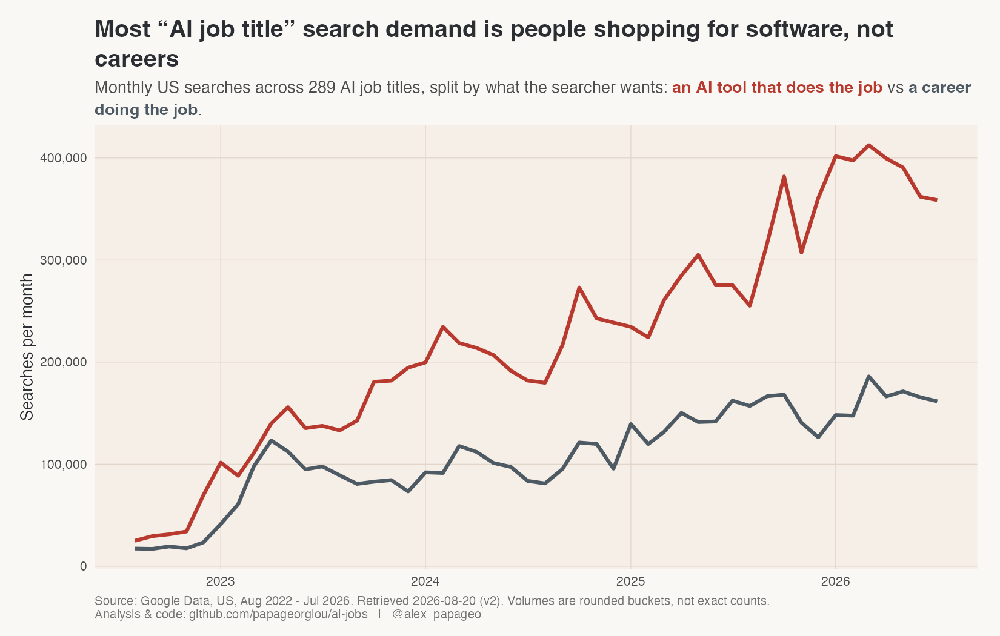

The share moved for two reasons that pull in the same direction: `forward deployed engineer`
added 18,100 to the career side, and `prompt engineer` lost 4,900 from it.

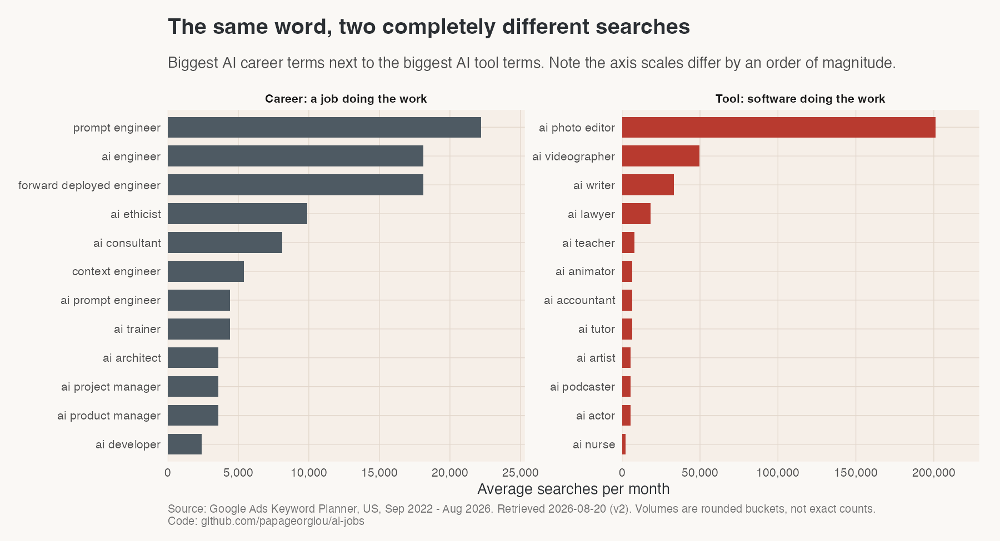

Everything from here on is career-intent terms only.

---

# Finding 2: forward deployed engineer

This is the finding that v1 could not have produced.

| | |
|---|---|
| Trailing 12-month average | **18,100/month** |
| Last three months (Jun–Aug 2026) | **38,033/month** |
| Latest month (Aug 2026) | **40,500/month** |
| Growth, first 12 months vs last 12 | **+5,656%** |
| Net searches/month gained | **+17,581** (largest of any career term) |
| Momentum rank | **1st of 289** |

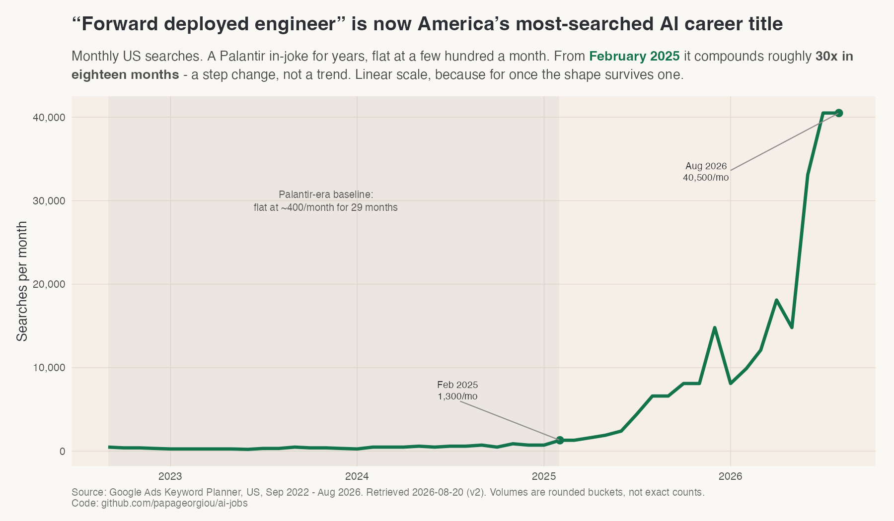

The shape is the point. From September 2022 to January 2025 the series is flat between 210
and 880 searches a month — the Palantir-era baseline, a job title that existed but that
almost nobody looked up. From February 2025 it climbs without a meaningful pause: 1,300 in
February 2025, 6,600 by August, 14,800 by December, 33,100 by June 2026, 40,500 in July and
August.

That is roughly a **30x increase in eighteen months**, and it is still at its high in the last
month of data.

The linear trend fit is deliberately reported as poor — R² of 0.49 on the rolling average.
That is not a weakness in the signal, it is a statement about its shape: this is a step
change with an exponential ramp, and a straight line is the wrong model for it. The same
caveat applied to `context engineer` in v1.

## Why the title is plausible on its own terms

`forward deployed engineer` is a Palantir coinage for an engineer embedded with a customer.
It stayed a Palantir-specific term for a decade. Through 2025 the AI labs adopted it wholesale
for the role of embedding engineers inside enterprise accounts to make model deployments
actually work. The search curve tracks that adoption, not a product launch — which is why it
compounds over eighteen months rather than spiking in one.

---

# Finding 3: prompt engineer has now been replaced twice

v1's Finding 2 was that `prompt engineer` peaked and `context engineer` replaced it. The first
half is more true than ever. The second half did not survive the extra month of data.

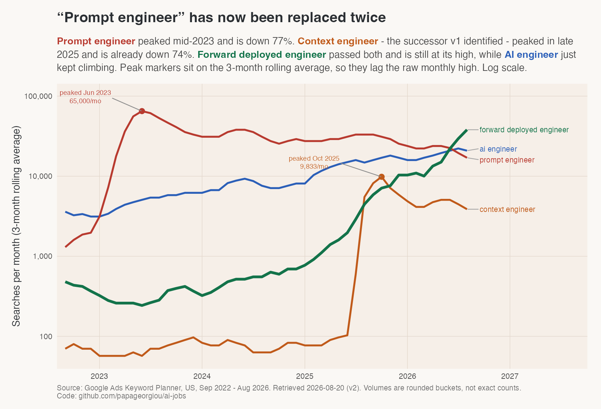

| Title | Peak | Last 3 months | Off peak |
|---|---|---|---|
| prompt engineer | 74,000 (May 2023) | 17,000 | **−77%** |
| context engineer | 14,800 (Aug 2025) | 3,867 | **−74%** |
| ai engineer | 22,200 (May 2026) | 20,833 | −6% |
| forward deployed engineer | 40,500 (Jul 2026) | 38,033 | **−6%** |

`prompt engineer` did not merely plateau. On the v1 window its first-year-to-last-year change
was −4%, which reads as flat. One month later it is **−22%**, and its trailing average fell
from 27,100 to 22,200 — the largest single move of any term between the two runs. The decline
is now unambiguous.

`context engineer` was v1's standout: 96x growth, near the top of both the growth-rate and
net-gain rankings. It is still the fastest-growing term in v2 by percentage (+7,656%), but it
peaked in August 2025 and has given back three quarters of it. v1 read an adoption spike as a
succession. It was a spike.

`ai engineer` remains the quiet story — no spike, no collapse, at 96% of its all-time high.

---

# Finding 4: the reported average is the wrong ranking metric

This is a methodological finding, and it generalises past this dataset.

Keyword Planner's `avg_monthly_searches` is a **trailing 12-month mean**. For a title whose
level is stable that is a fine summary. For a title that stepped up mid-window it is roughly
the midpoint of the step, which is not a number that describes any actual month.

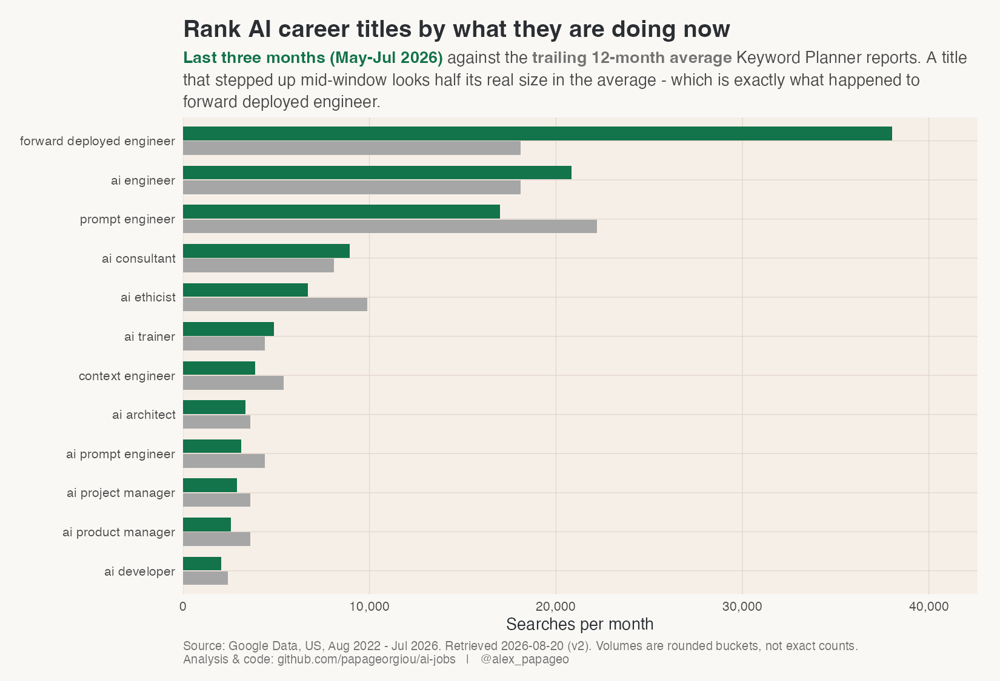

`forward deployed engineer` reports 18,100 and is running at 38,033 — the reported figure is
**47% of the real current level**. The error runs the other way for declining titles:
`ai ethicist` reports 9,900 and is running at 6,700.

Ranked on the reported average, `prompt engineer` leads at 22,200, with
`forward deployed engineer` and `ai engineer` tied behind it at 18,100. Ranked on the last
three months the order inverts completely: `forward deployed engineer` (38,033), `ai engineer`
(20,833), `prompt engineer` (17,000).
v1 ranked on the average throughout, which is a reasonable default and was the right call for
a set of mostly stable series. It stops being the right call once a step-change term is in the
universe.

---

# Finding 5: most AI job titles are already past their peak

Setting each title against its own best month, rather than against each other, produces a
picture that neither v1 nor the growth rankings show.

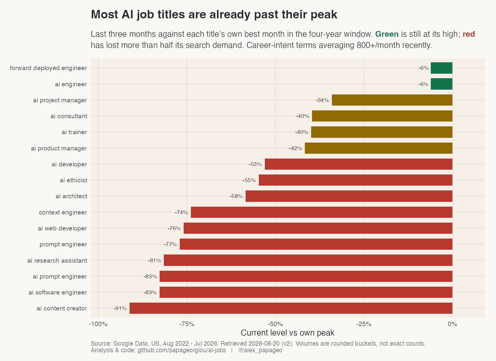

Of the 16 career terms in the chart, two are within 15% of their peak — `forward deployed
engineer` and `ai engineer`. Four are 30–45% off. **Ten have lost more than half their
search demand**, including `prompt engineer` (−77%), `ai prompt engineer` (−83%),
`ai software engineer` (−83%) and `ai content creator` (−91%).

The AI job-title vocabulary turns over fast. Most of what was worth writing about in 2023 is
in decline as a search term, and the growth is concentrated in a very small number of names.

---

# Finding 6: growth rate and net volume still disagree — with one exception

v1's Finding 3 was that percentage growth and absolute gain rank nearly disjoint sets of
titles. That remains true, and it remains the reason to report both.

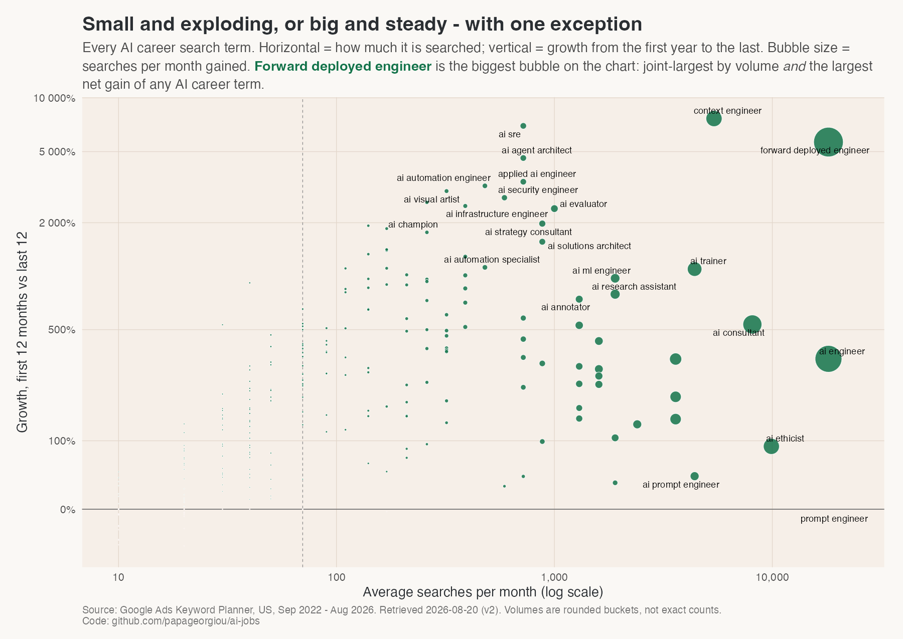

Ranked by **percentage growth**, the top is still titles that barely existed in 2022, most of
them under 1,000 searches a month:

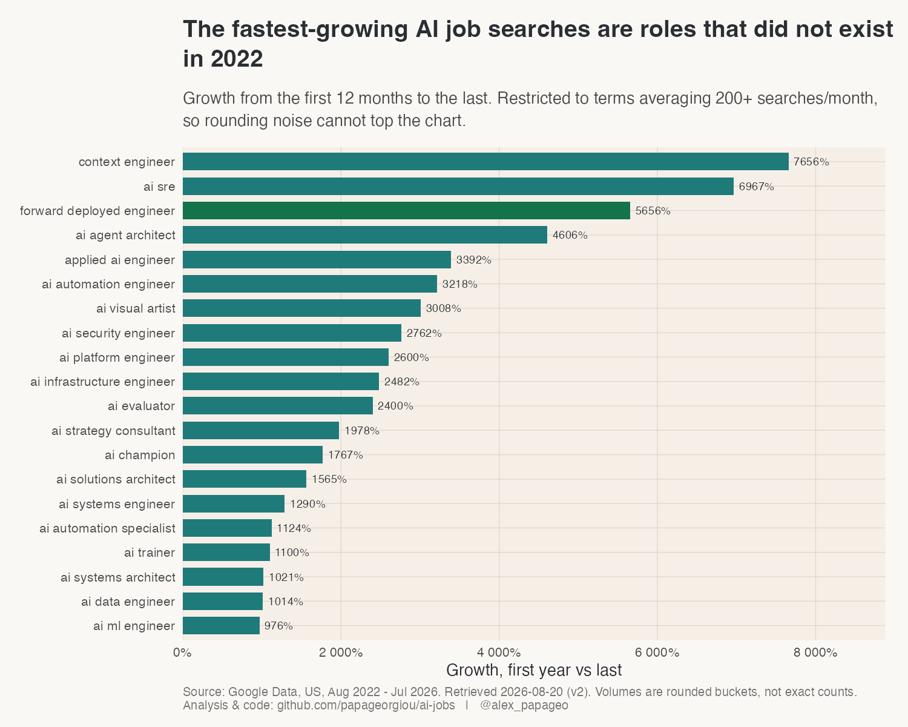

Ranked by **searches actually gained**:

| Title | Searches/mo gained | Growth |
|---|---|---|
| forward deployed engineer | **+17,581** | +5,656% |
| ai engineer | +14,350 | +340% |
| ai consultant | +6,994 | +540% |
| context engineer | +4,977 | +7,656% |
| ai ethicist | +4,925 | +90% |
| ai trainer | +3,995 | +1,100% |

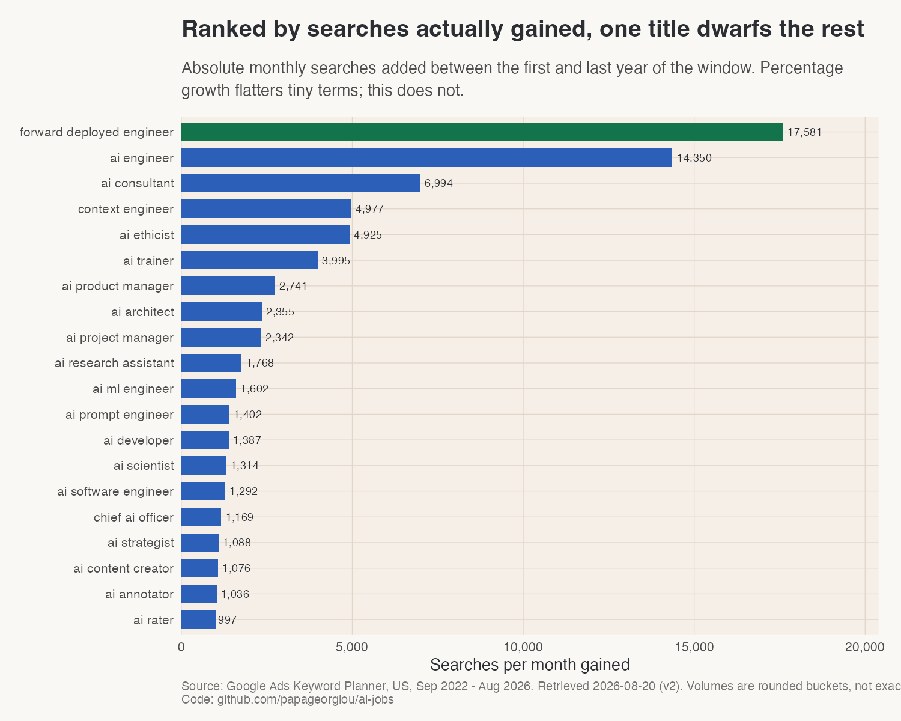

`forward deployed engineer` is the exception the v1 data did not contain: **first by net gain
and third by growth rate** (among terms averaging 200+ a month), while sitting at the top of the volume distribution. In v1 only
`context engineer` came close to that combination, at a fifth of the volume — and it has since
turned over.

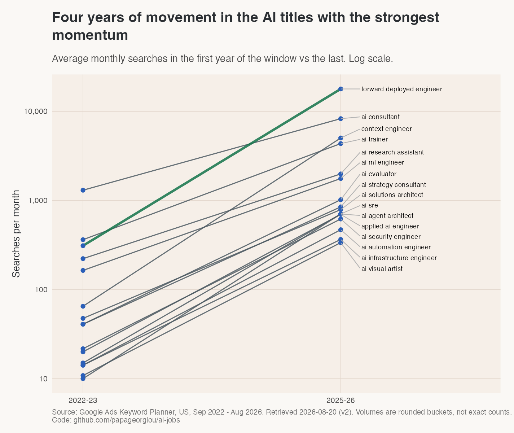

---

# Finding 7: the whole field, and the clusters

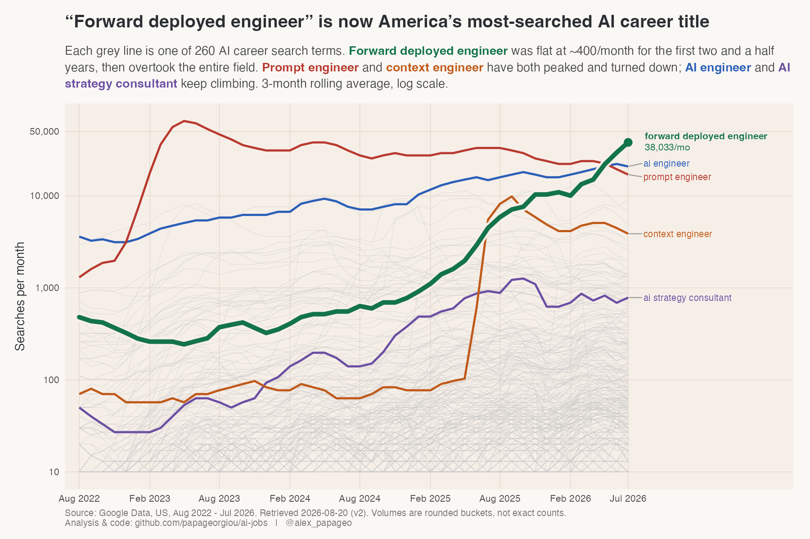

Log scale, because the biggest career terms sit in the tens of thousands while the emerging
ones sit in the hundreds.

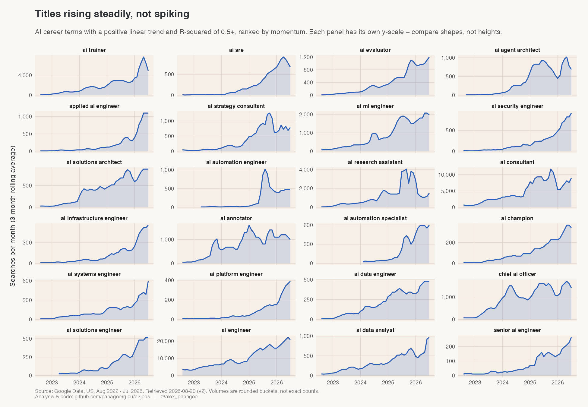

Career-intent volume grouped by what the role actually does:

| Function | Terms | Searches/mo | Gained | Growth |
|---|---|---|---|---|
| engineering | 78 | 90,790 | +48,958 | +114% |
| other | 67 | 20,560 | +13,066 | +166% |
| product & program | 22 | 19,650 | +15,551 | +390% |
| research | 14 | 5,990 | +5,000 | +411% |
| data & alignment | 10 | 5,770 | +4,384 | +342% |
| education & coaching | 8 | 4,910 | +4,451 | +1,097% |
| design & creative | 22 | 4,350 | +2,792 | +181% |
| leadership | 12 | 2,920 | +2,177 | +240% |
| infrastructure & ops | 11 | 1,750 | +1,614 | +1,957% |
| governance & ethics | 16 | 640 | +535 | +440% |

Gained and Growth are both computed on the summed cluster series, first 12 months
against last 12 -- not as a sum of the per-title figures, which drop leading zero
months individually and so total slightly lower.

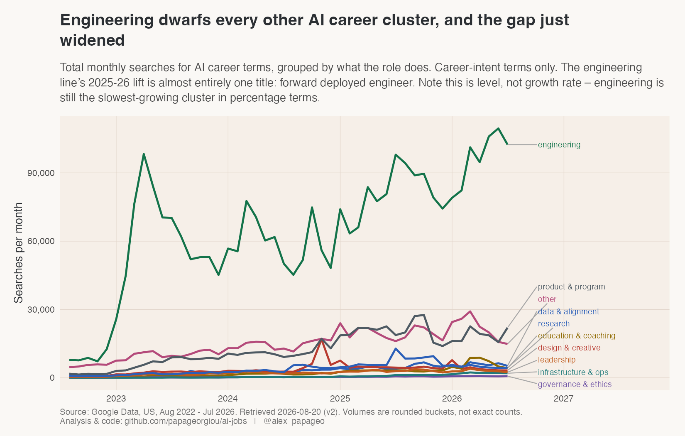

**Engineering's lead widened, and it is one title.** The cluster's net gain goes from +39,159
in v1 to +48,958 in v2 — more than three times the next cluster. Almost all of that delta is
`forward deployed engineer`.

**Engineering is still the slowest-growing cluster in percentage terms.** +114% first year
against last, last of the ten. Level and rate genuinely disagree here, and v1's conclusion —
that engineering is not where the *fastest* growth is — survives v2 intact. What changed is
that engineering is now pulling further ahead in absolute searches while still growing
slowest in relative terms.

**Governance and ethics is still remarkably small.** 16 titles, 640 searches a month between
them. As in v1, `ai ethicist` (9,900/month) sits in the `other` bucket, which understates
this cluster badly — see caveats.

## Nobody searches for a seniority level

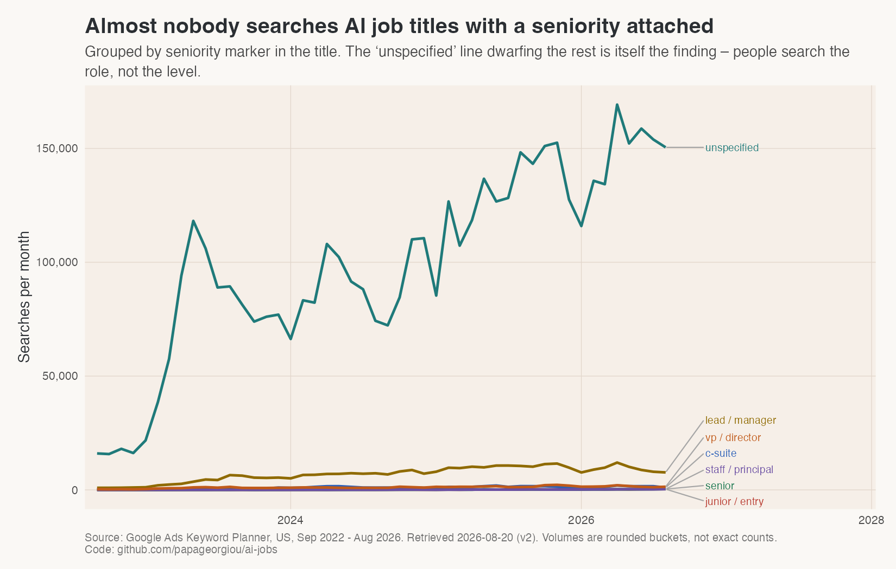

208 of 260 career terms carry no seniority marker, and they account for essentially all the
volume. `forward deployed engineer` is itself an example — nobody searches `senior forward
deployed engineer`.

## And almost nobody searches by industry

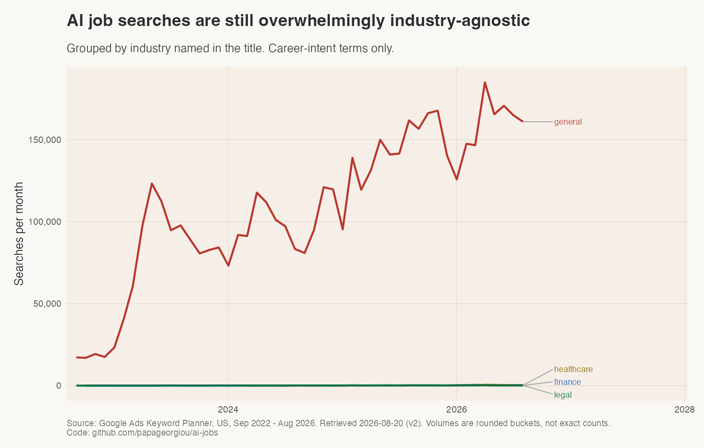

274 of 289 terms are industry-agnostic.

---

# What changed between v1 and v2

| | v1 | v2 |
|---|---|---|
| Window | Aug 2022 – Jul 2026 | Sep 2022 – Aug 2026 |
| Titles | 1,052 | 1,053 |
| Modelable terms | 283 | 289 |
| Tool-intent share of volume | 71.0% | 69.5% |
| Largest career term (avg) | prompt engineer, 27,100 | prompt engineer, 22,200 |
| Largest career term (last 3mo) | — | **forward deployed engineer, 38,033** |
| Top term by momentum | context engineer | **forward deployed engineer** |
| Largest net gain | ai engineer, +14,283 | **forward deployed engineer, +17,581** |
| The prompt-engineer successor | context engineer | context engineer, then FDE |
| prompt engineer, first yr vs last | −4% | **−22%** |

Only 45 of the 283 shared keywords changed their reported average at all between the two
pulls, and most moves were one rounding bucket. The material ones were `prompt engineer`
(−4,900), `context engineer` (−1,200), `ai podcaster` (−1,200) and `ai architect` (−800) —
all declines, all consistent with the one-month window shift catching more of a downturn.

**Conclusions that survived v1 unchanged:** the tool-versus-career split and its size; the
peak and decline of `prompt engineer`; the steady non-spiking rise of `ai engineer`; the
seniority and industry findings; the disagreement between growth rate and net volume; the
small size of governance and ethics; that roughly two-thirds of circulating AI job titles
have no measurable search demand.

**Conclusions that changed:** which title leads the field; which title succeeded
`prompt engineer`; whether any title is simultaneously large, fast-growing and high-gaining;
and whether the reported 12-month average is a safe ranking metric.

---

# Caveats worth stating

- **Reported volume is not ground truth.** Rounded buckets, and inflatable by non-human
  traffic.
- **`forward deployed engineer` is flagged by the spike detector** (ratio 68.6 against its
  own median, flagged month July 2026), and it is worth being explicit about why it is kept.
  The detector compares the maximum against the median of the whole 48-month series, so any
  genuine step change scores high — the median here is dominated by the 29 flat baseline
  months. The distinguishing evidence is duration: this is eighteen consecutive months of
  increase, not one anomalous month, and the last three months are all at the top. A bot or
  scraping artifact does not usually hold a plateau for a quarter. `context engineer` was
  flagged on the same logic in v1 and judged genuine on the same grounds — and note that it
  subsequently reverted, which is the outcome this caveat exists to allow for.
- **Two things changed between v1 and v2**, not one. The added title is the intended change;
  the one-month window shift is a side effect of re-pulling. Where a number moved, the
  "What changed" section says which cause is responsible.
- **The tool-versus-career split is a judgement call**, applied by rule against a list of
  professions AI performs as a service. `ai trainer` and `ai architect` are deliberately kept
  as careers despite matching the pattern. `forward deployed engineer` does not match the
  `ai <profession>` shape at all, so it is classified as career intent without a judgement
  call being needed.
- **`ai ethicist` (9,900/month) still falls into the `other` function bucket** rather than
  governance and ethics, which understates that cluster in the table above. Unchanged from
  v1 and still not hand-patched.
- **Only the bare title was added.** `Forward Deployed Software Engineer` and `Forward
  Deployed Machine Learning Engineer` are in circulation and were deliberately left out, to
  keep v2 comparable to v1 at one changed input. The true demand for the role family is
  therefore somewhat higher than the figures here.
- **73 non-seasonal spikes were flagged**, against 76 in v1.

---

# Method

Full pipeline and data at `github.com/papageorgiou/ai-jobs`. v1 artifacts are in `output/`
and v2 in `output_v2/`; both are reproducible, and v1 is unmodified.

Volumes pulled via the Google Ads Keyword Planner API in a single `get_volumes` request
(1,052 keywords, US, English). Series are 48 months. Growth is measured by comparing the mean
of the last 12 months against the mean of the first 12, which is robust to seasonality;
`momentum` averages the percentile ranks of proportional and absolute growth so that a
fast-growing niche term and a large steady one can be compared on one scale. Trends are OLS
fits on a 3-month rolling average. Clusters are rule-based on the title text across three
independent axes.

The v2 run differs from v1 only in its input list and its retrieval date. Every script from
`00_prep_keywords.py` through `03_cluster.py` is the same file, run with `OUTPUT_DIR` and
`MASTER_CSV` pointed at the v2 artifacts. Charts are a separate script, `04_charts_v2.R`,
because several v1 chart *conclusions* no longer hold and rewriting them in place would have
broken v1's reproducibility.
