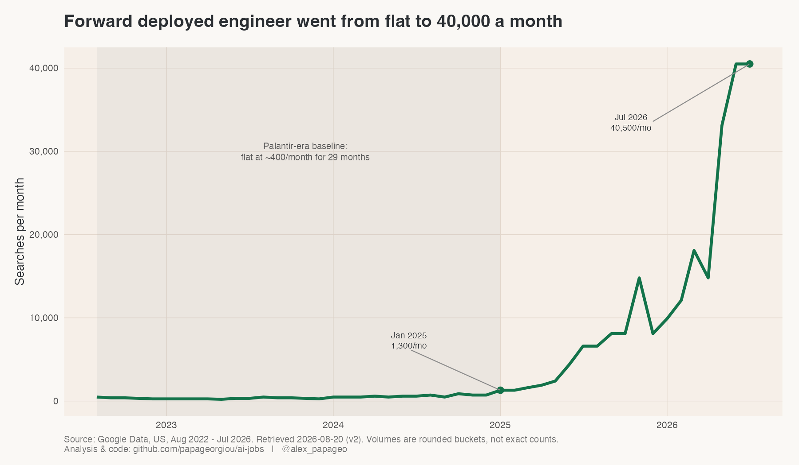
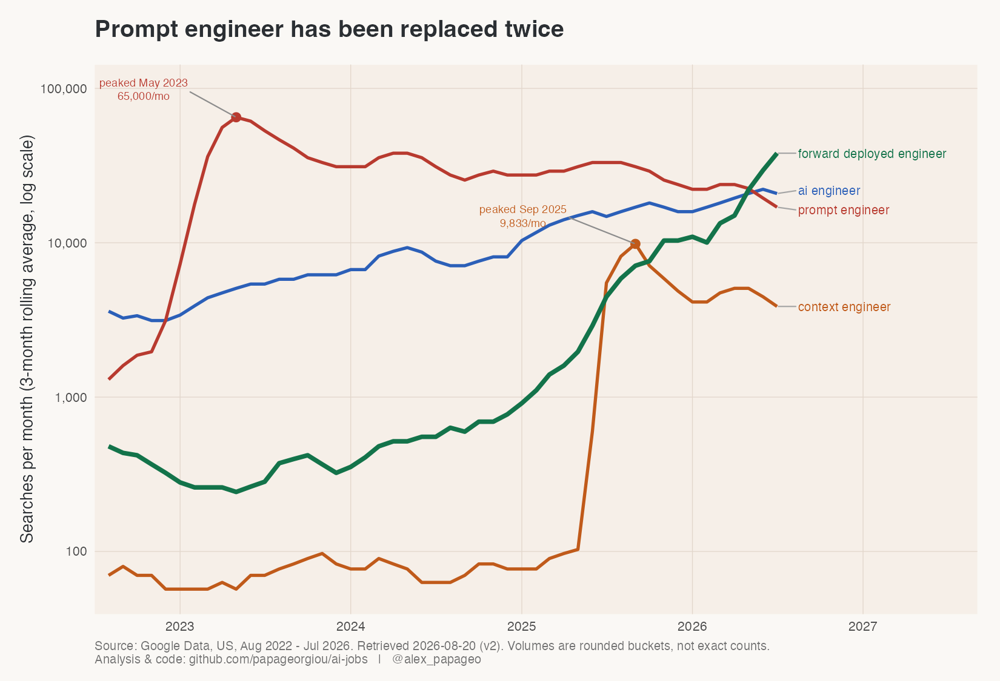
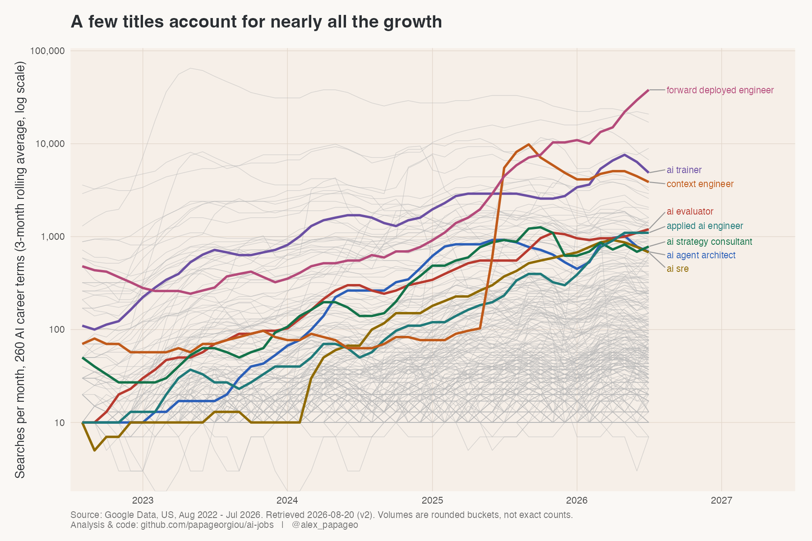
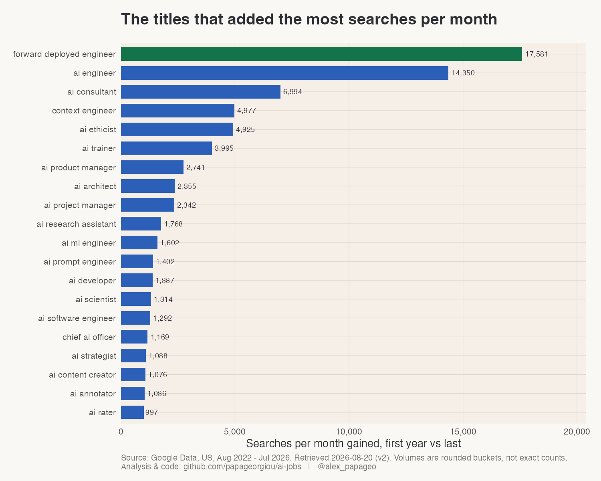
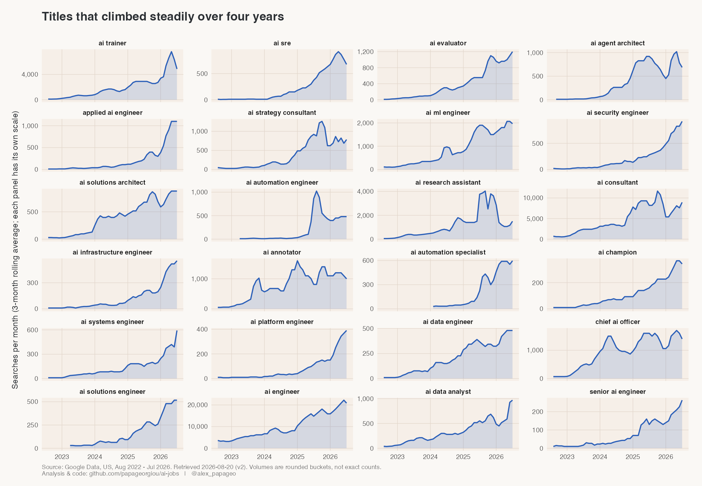
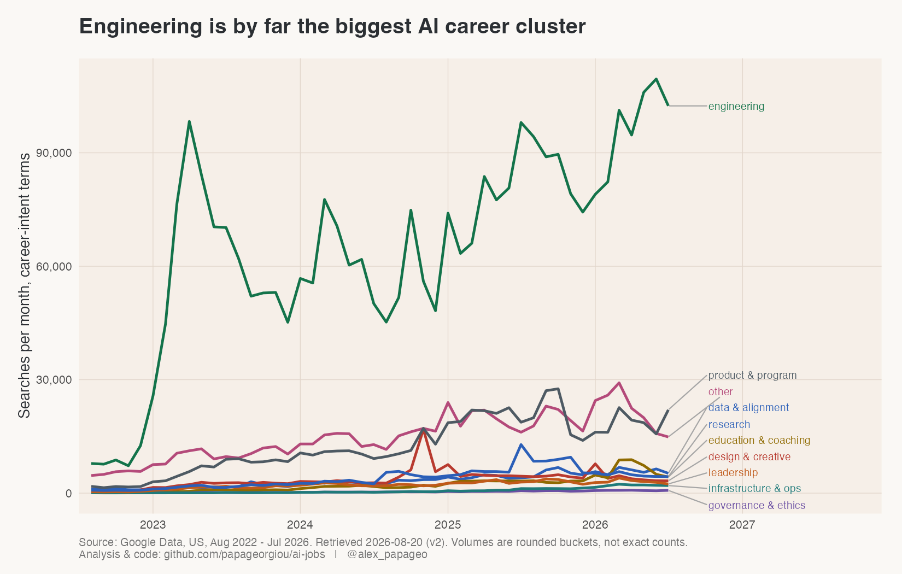
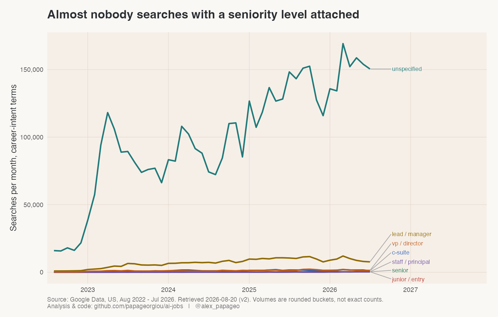

The benefits of search data go well beyond keyword research for SEO.

I pulled monthly US Google search volume for 1,053 AI job titles, covering August 2022 to July 2026. Every number below is a count of how many people typed that job title into Google in a given month.

## Why search data is a good way to read a job market

- **It is close to real time.** The data arrives monthly with about a month of lag. Job boards tell you what companies decided to post. Search tells you what people were curious about last month.
- **Nobody was asked a question.** There is no survey, no panel and no incentive to answer in a particular way. Someone wanted to know about a job and typed it in.
- **The sample is everyone who searched.** Coverage comes from the whole searching population rather than the slice of it that agrees to fill in a form.
- **The unit is absolute.** Searches per month, so a title can be compared against another title and against zero. Most trend tools give you an index that only makes sense relative to itself.
- **It works before anything else has data.** A new title has no job postings, no salary survey and no entry in any official taxonomy. It still shows up in search the moment people start looking it up.
- **It leads the formal record.** People search a title before they apply for it, and long before an institution agrees the title exists.

The obvious limits apply and I come back to them at the end.

## What I pulled

The title list was assembled from four independently generated sources, then filtered for an AI signal in the name. Of the 1,053 titles, 289 had enough consistent volume to model. The rest sit at or near zero.

That last part is a finding in itself. Roughly two thirds of the AI job titles in circulation have no measurable search demand at all. They live in articles, LinkedIn headlines and consulting decks. Almost nobody looks them up.

## One title came out of nowhere

Forward deployed engineer sat flat at about 400 searches a month for 29 months. Then it rose roughly a hundred times, and it was still at its highest point in the final month of data.

The title is not new. Palantir created it around 2005 for engineers who go and sit with the customer, live inside the problem and build the solution on site. What changed is who uses it. [OpenAI and Anthropic both built the role into their enterprise businesses](https://thenewstack.io/forward-deployed-engineers-ai/), OpenAI under a deployment organisation and Anthropic under applied AI, and the rest of the enterprise AI market followed.

The reason is unglamorous and important. Models got good enough for most enterprise use cases. The difficulty moved to the last mile: connecting a model to the actual systems of record, ticketing platforms, ERP layers and knowledge bases that a pilot is carefully designed to avoid touching. MIT's NANDA project found that [around 95% of enterprise generative AI pilots deliver no measurable return](https://finance.yahoo.com/news/mit-report-95-generative-ai-105412686.html). When the model works and the deployment does not, you hire people whose entire job is deployment. [TechTarget's write-up of the role](https://www.techtarget.com/ai/feature/The-rise-of-the-AI-forward-deployed-engineer) makes the same point from the vendor side.

There is a second reason this title matters to me, and it is about method. My filter looked for an AI signal in the name: AI, LLM, agentic, prompt. "Forward deployed engineer" contains none of those words, so it never entered the study. I had to add it by hand after noticing it elsewhere.

A rule-based filter misses exactly the roles whose names have not caught up with what they do. Those are usually the interesting ones.

## Titles keep replacing titles

Prompt engineer peaked in May 2023 and has been passed twice since.

Context engineer took over in mid-2025, right after [Tobi Lütke and Andrej Karpathy both said publicly that they preferred the term](https://blog.getzep.com/what-is-context-engineering/). It climbed very quickly, held the top spot for about three months, and then gave back most of the gain. Forward deployed engineer went past both of them.

I read this as the name following the hard part of the work. In 2023 the hard part was writing the prompt. By 2025 the prompt was a small fraction of what actually goes into a model call, and the difficulty was assembling everything around it: conversation history, retrieved documents, tool output, agent state. By 2026 the difficulty is getting any of it to run inside a real company.

The work does not disappear when a title stops growing. It gets absorbed. Almost nobody advertises for a prompt engineer today because writing prompts became part of several other jobs.

This is the practical argument for watching search instead of a job taxonomy. A taxonomy updates once a committee agrees a title exists. Search shows the name changing while it is still changing.

## The growth is very concentrated

Each faint grey line is one job title. A handful of coloured lines account for most of the movement in the whole set. The majority sit under 1,000 searches a month and stay there for four years.

Two ways of measuring growth rank almost completely different titles, so it is worth being explicit about which one is being used. A title going from 10 to 700 searches a month is a 70x rise and 690 extra people. A title going from 6,000 to 20,000 is a far smaller multiple and a far larger number of people. Percentage growth flatters anything starting from a small base, and net gain flatters anything that was already large.

## Three kinds of work are rising quietly

Under the headline names sits a group of titles that climbed steadily for four years without a spike. They sort into three kinds of work, and each one has a clear cause.

**Getting AI into someone else's systems.** Applied AI engineer, AI solutions architect, AI security engineer. This is the same last-mile problem as forward deployed engineer, described in different words by companies that would rather not use the Palantir vocabulary.

**Keeping it running once it is live.** AI SRE, AI infrastructure engineer, AI platform engineer. Google's own SRE organisation now publishes on [operating agentic systems in production](https://cloud.google.com/blog/products/devops-sre/how-google-sre-is-using-agentic-ai-to-improve-operations), and treating an agent like a production service with an SLO and an on-call rotation is becoming ordinary practice. Infrastructure and operations is the fastest growing of the ten job clusters in percentage terms, off a very small base.

**Judging what the model produces.** AI evaluator, AI annotator, AI trainer. AI trainer is one of the strongest risers in the entire study. The cause is that human judgement became a priced input to model quality: the [data labelling market runs at a few billion dollars a year](https://www.herohunt.ai/blog/the-ultimate-ai-data-labeling-industry-overview/), and the expert tier of it pays domain specialists to build evaluations and reinforcement learning environments rather than to draw boxes on images.

If you want a single sentence for where AI hiring energy is going, it is towards deploying, operating and evaluating models rather than towards building them.

## Engineering carries most of the demand

Engineering is larger than all nine other clusters put together. That is unsurprising on its own. The useful part is that engineering is also the slowest growing of the ten clusters in percentage terms.

Both things are true at once because engineering started from a large base in 2022 and kept adding volume, while the fast percentage growth happens in small clusters where a few hundred extra searches doubles the total. Anyone quoting a growth rate for an AI job family should say which of the two they mean.

Governance and ethics is worth a mention for being small. Sixteen titles, and a combined volume in the hundreds of searches a month. Whatever is happening in AI governance is not yet happening in the labour market people search for.

## Almost nobody searches with a seniority level

Of the 260 career titles, 208 carry no seniority word at all. Industry is the same story: only 15 of 289 titles carry a sector word like healthcare, legal or finance.

People search "ai engineer". Very few add "senior" in front of it, and very few add "healthcare" either. The plain title carries essentially all the demand.

That has a direct practical use. If you are naming a role, writing about one or trying to be found for one, the unqualified title is the one people look for. Each qualifier you add cuts the audience by a large factor.

## What I would not claim from this

- **These are rounded buckets.** Google Keyword Planner returns values snapped to a grid, and volumes can be inflated by automated traffic. Treat every figure as an order of magnitude with a direction attached.
- **A search is curiosity.** It is evidence that people want to know about a job. It is not a job opening, a hire or a salary.
- **The headline finding could revert.** Context engineer passed exactly the same test a year ago and then gave back three quarters of its peak. What makes forward deployed engineer more convincing is duration, eighteen consecutive months of increase with the last three at the top, but that is a judgement rather than a proof.
- **The reported average is misleading for anything that stepped up.** Keyword Planner's headline figure is a trailing twelve month mean. For forward deployed engineer it reports a number that is roughly half the current running level, describing no actual month. I rank on the last three months wherever the ranking is the point.

The code, the title list and every chart are in the [repository](https://github.com/papageorgiou/ai-jobs).

::: {.callout-note appearance="simple"}
**Source.** Google Ads Keyword Planner API, US, English. 1,053 titles pulled 2026-08-20, covering August 2022 to July 2026. 289 titles cleared the modelling threshold. Analysis in Python, charts in R.
:::
